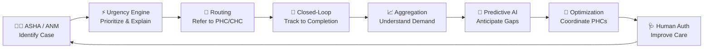
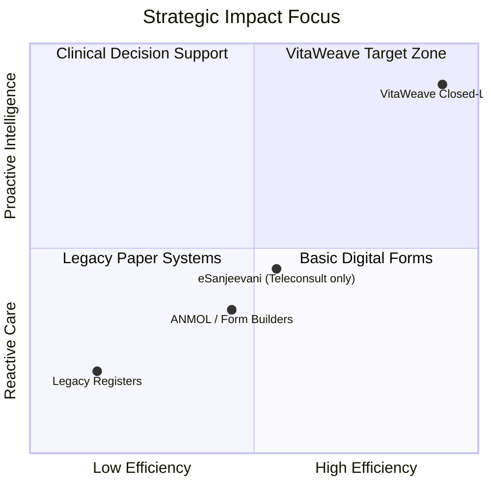
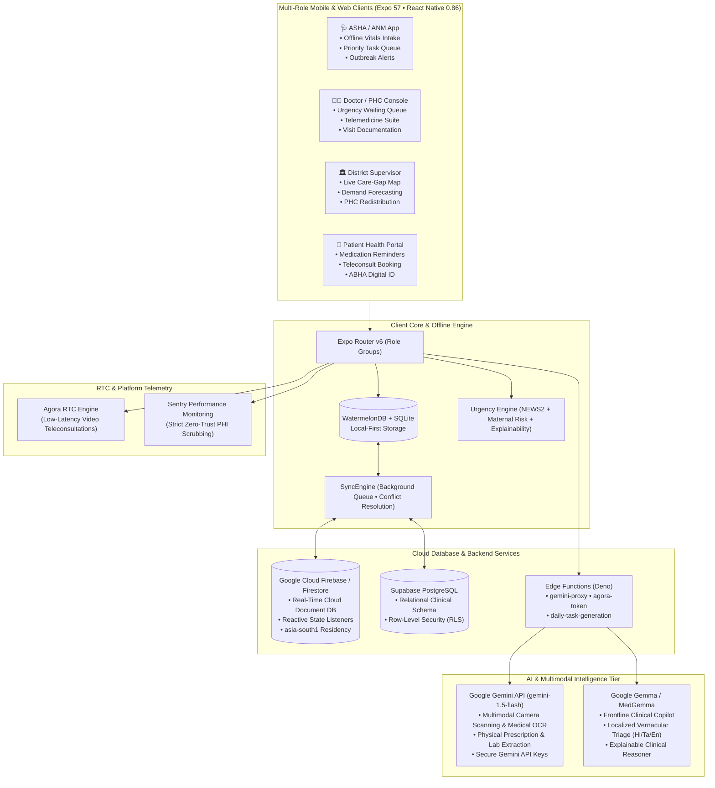

# VitaWeave

### AI-Powered Frontline Health Intelligence and Resource Coordination Platform

[](https://expo.dev)
[](https://reactnative.dev)
[](https://firebase.google.com)
[](https://ai.google.dev)
[](https://ai.google.dev/gemma)
[](https://supabase.com)
[](https://www.agora.io)
[](https://www.typescriptlang.org)

---

## 📌 Abstract

> **VitaWeave: AI-Powered Frontline Health Intelligence and Resource Coordination Platform**
>
> Rural healthcare delivery in India depends heavily on **ASHA and ANM workers** who serve as the first point of contact for communities. However, frontline workers often manage large numbers of households without intelligent support to determine which patients require immediate attention, whether referrals are completed, or where healthcare resource gaps are emerging.
>
> **VitaWeave** is an AI-powered frontline health intelligence platform designed to empower ASHA and ANM workers with actionable decision support. Instead of treating frontline workers primarily as data-entry personnel, VitaWeave transforms the information they collect into intelligence that helps determine **who needs attention first**, **what action is required**, and **whether that action was completed**.
>
> Through an **offline-first mobile application**, ASHA/ANM workers can register patients, record health information, monitor vaccinations and community alerts, and receive an AI-prioritized daily task list. VitaWeave's **urgency engine** analyzes patient information, vitals, visit history, and risk factors to identify high-priority cases and explain why they require attention. When escalation is necessary, the platform supports referral routing and tracks the referral through completion, helping reduce gaps between identification and actual care.
>
> VitaWeave extends this patient-level intelligence into **health-resource intelligence**. Aggregated frontline demand signals can be combined with Primary Health Centre (PHC)-level information such as medicine availability, patient footfall, bed capacity, staff availability, and resource utilization. AI models identify emerging demand patterns and provide early warnings for potential resource shortages.
>
> When a shortage is predicted, the platform identifies suitable resources at nearby PHCs and generates **explainable redistribution recommendations** based on demand, urgency, availability, distance, and safety-stock requirements. These recommendations remain subject to authorization by healthcare administrators, keeping humans in control of operational decisions.
>
> By combining frontline AI decision support, closed-loop referral coordination, demand intelligence, resource forecasting, and human-in-the-loop optimization, VitaWeave aims to help rural healthcare move from reactive care delivery to proactive, coordinated, and data-driven healthcare delivery.

---

## 🔄 The Continuous Coordination Loop

VitaWeave replaces fragmented paper-based triage and disconnected administrative forms with an uninterrupted, closed-loop cycle of frontline clinical intelligence and health-system coordination:



| Stage | What VitaWeave Does |
|---|---|
| **1. Identify** | ASHA/ANM registers citizen in the field with offline-first capture, multimodal scanning of existing records, and structured vital signs. |
| **2. Prioritize** | Clinical Urgency Engine evaluates physiological markers (NEWS2 + Maternal Risk) to calculate a 0–100 priority score with clinical explainability tags. |
| **3. Refer** | Automatically matches patient urgency with the correct facility tier (Sub-Centre → PHC → CHC → District Hospital) or initiates telemedicine. |
| **4. Track** | Digital tracking monitors every step (dispatch → arrival → consultation → prescription → discharge) to eliminate referral drop-off. |
| **5. Understand Demand** | Field diagnoses and community alerts are aggregated in real time across villages, wards, and administrative blocks. |
| **6. Anticipate Gaps** | Demand forecasting correlates frontline disease spikes with PHC medicine stock, bed occupancy, and diagnostic consumables. |
| **7. Coordinate** | Algorithmic redistribution calculates optimal resource transfers between nearby PHCs based on distance, surplus, and buffer-stock rules. |
| **8. Improve Care** | District health administrators authorize redistribution orders, closing the loop to ensure care delivery is never bottlenecked. |

---

## 🎯 Four Core Measurable Outcomes

VitaWeave measures frontline impact against four core operational metrics:



1. **⏱️ Reduced Time-to-Intervention**: Slashes the latency between identifying a high-risk maternal or decompensating patient and conducting an in-person health worker visit.
2. **📉 Zero Referral Drop-Off**: Closes the loop on specialist and PHC escalations with bidirectional status confirmations between frontline workers and doctors.
3. **🎯 Elevated Frontline Diagnostic Precision**: Empowers ASHA workers with AI-guided differential triage, increasing the accurate identification of critical cases.
4. **📊 Live Care-Gap Visibility**: Replaces static retrospective form counts with real-time operational maps showing active care gaps, pending visits, and emergent supply shortages.

---

## 🏗️ System Architecture

VitaWeave is engineered as a modern, resilient, multi-tiered health intelligence operating system built for remote rural settings with intermittent connectivity:



---

## 💻 Complete Technology Stack

| Layer | Technology | Key Highlights & Architectural Role |
|---|---|---|
| **Mobile & Web Client** | **React Native 0.86** + **Expo 57** | Cross-platform native application for Android, iOS, and Web; role-based architecture with Expo Router v6. |
| **Cloud Database** | **Google Cloud Firebase / Firestore** | Scalable, real-time cloud document database in region `asia-south1` (Mumbai) powering live state listeners, high-risk alerts, and PHC inventory synchronization. |
| **Relational Backend** | **Supabase (PostgreSQL 15)** | Relational clinical records, cryptographic multi-tenancy, Row Level Security (RLS), and automated database triggers. |
| **Offline-First Storage** | **WatermelonDB** + **expo-sqlite** | Local-first relational database allowing full patient registration, triage, and task completion in 100% offline rural dead-zones. |
| **Multimodal Scanning & OCR** | **Google Gemini API** (`gemini-1.5-flash`) | Multimodal camera scanning of paper prescriptions, handwritten ANC cards, and diagnostic lab reports powered exclusively via secure **Gemini API keys**. |
| **Clinical Decision AI** | **Google Gemma / MedGemma** | Medical AI model architecture adapted for frontline triage, vernacular query comprehension (Hindi, Tamil, English), and explainable risk factor generation. |
| **Telemedicine RTC** | **Agora RTC Engine** (`react-native-agora`) | Low-latency audio/video consultations between frontline workers, patients, and PHC doctors with server-minted access tokens. |
| **Urgency Engine** | **NEWS2 + Maternal Risk Algorithms** | Physiological triage engine integrating Royal College of Physicians NEWS2 protocols and maternal health risk features. |
| **Security & Privacy** | **DPDP Act 2023 & ABDM Compliance** | Client-side AES-GCM field encryption, zero-trust PHI redaction, explicit consent gates, and Ayushman Bharat Digital Mission (ABDM) integration. |
| **Observability** | **Sentry React Native** | Crash monitoring, telemetry, and performance tracing with client-side PHI sanitization before transmission. |

---

## 🌟 Key Functional Modules

### 1. 🩺 Frontline ASHA / ANM Experience (`app/(asha)`)
- **AI-Prioritized Daily Task List**: Every morning, the application analyzes scheduled visits, missed checkups, immunization deadlines, and triage urgency to construct an optimal daily itinerary.
- **Offline Clinical Vitals & Triage**: Capture respiration, SpO₂, blood pressure, temperature, and blood glucose without internet; score updates instantaneously.
- **Multimodal Document & Prescription Scanner**: Uses **Google Gemini Vision** (via Gemini API keys) to scan physical prescriptions, handwritten ANC cards, and lab test results, converting paper data into structured digital records.
- **MedGemma Clinical Assistant**: Conversational clinical copilot supporting vernacular queries in Hindi, Tamil, and English, providing triage recommendations and differential insights.
- **Universal Immunization Programme (UIP)**: Tracks age-specific vaccine milestones for infants and expectant mothers with overdue alerts.
- **Community Outbreak Early Warning**: Syndromic surveillance logging symptom clusters (fever spikes, diarrheal episodes, acute respiratory infections) to detect ward epidemics early.

### 2. 👨‍⚕️ Doctor & PHC Outpatient Console (`app/(doctor)`)
- **Urgency-Ranked Queue**: Outpatient waiting lists are dynamically sorted by clinical priority score rather than arrival time, ensuring critical patients are seen first.
- **Integrated Telemedicine**: High-performance Agora video calling directly connects doctors to rural sub-centres with single-tap connection.
- **Clinical Encounter Documentation**: Record visit notes, prescribe medications, and automatically trigger follow-up home visit tasks in the assigned ASHA worker's schedule.
- **Closed-Loop Referral Inbox**: Receive and acknowledge referred patients from field workers, update diagnoses, and transmit discharge summaries back to the village.

### 3. 🏛️ District Health Supervisor & Resource Coordinator (`app/(admin)`)
- **Live Care-Gap Heatmap**: District-wide geospatial dashboard displaying active care gaps, delayed visits, and pending referrals across all administrative wards.
- **Frontline Demand Aggregation**: Correlates community-level diagnostic trends with PHC operational metrics (medicine stock, bed occupancy, doctor availability).
- **Predictive Shortage Warnings**: Early warning indicators forecasting stockouts for critical supplies (e.g., ORS, iron-folic acid, oxytocin, antivenom, antibiotics).
- **Inter-PHC Explainable Redistribution**: Automated matching engine generates redistribution proposals across neighboring health facilities based on distance, surplus volume, demand urgency, and safety stock buffers.
- **Human-in-the-Loop Governance**: Administrators retain complete operational control to approve, modify, or reject redistribution proposals before execution.
- **Immutable Audit Trail**: Transparent logging of all priority scores, overrides, and administrative actions.

### 4. 📱 Citizen & Patient Companion (`app/(patient)`)
- **Medication Adherence Engine**: Timed dosage alarms with one-tap confirmation and dose logging.
- **Direct Appointment Booking**: Schedule in-person PHC appointments or remote teleconsultations.
- **ABHA Digital Health ID**: Seamless integration with Ayushman Bharat Digital Mission (ABDM M1/M2 standards).
- **Multilingual Patient Dashboard**: Complete interface localized in English, Hindi, and Tamil.

---

## ⚡ Quick Start & Development Setup

### Prerequisites

- **Node.js**: v18.0.0 or higher
- **Package Manager**: npm v9+ or yarn
- **Expo CLI**: `npx expo`
- **Google Cloud Account**: For Google Cloud Firebase / Firestore & Google Gemini API keys
- **Supabase Account**: For PostgreSQL database and Edge Functions
- **Agora Developer Account**: For Agora App ID and App Certificate

### 1. Clone & Install

```bash
# Clone the repository
git clone https://github.com/AjayRajan05/VitaWeave.git
cd VitaWeave/project

# Install dependencies
npm install --legacy-peer-deps
```

### 2. Configure Environment Variables

Create your local `.env` file from the provided example:

```bash
cp .env.example .env
```

Configure your credentials:

```env
# Google Cloud Firebase Configuration
EXPO_PUBLIC_FIREBASE_PROJECT_ID=your-firebase-project-id
EXPO_PUBLIC_FIREBASE_API_KEY=your-firebase-api-key
EXPO_PUBLIC_FIREBASE_AUTH_DOMAIN=your-firebase-project.firebaseapp.com
EXPO_PUBLIC_FIREBASE_STORAGE_BUCKET=your-firebase-project.appspot.com

# Google Gemini API & Gemma Model Configuration
# All AI decision support and multimodal scanning use Gemini API keys
EXPO_PUBLIC_GEMINI_API_KEY=your-google-gemini-api-key
EXPO_PUBLIC_GEMINI_MODEL=gemini-1.5-flash
EXPO_PUBLIC_USE_EDGE_PROXY=true

# Supabase Backend & Database
EXPO_PUBLIC_SUPABASE_URL=https://your-project.supabase.co
EXPO_PUBLIC_SUPABASE_ANON_KEY=your-supabase-anon-key
EXPO_PUBLIC_SUPABASE_REGION=ap-south-1

# Agora Telemedicine RTC
EXPO_PUBLIC_AGORA_APP_ID=your-agora-app-id

# Application Configuration
EXPO_PUBLIC_DEV_MODE=false
EXPO_PUBLIC_ABDM_MODE=mock
```

> 📖 **Production Credential Guide**: For production credentials, secret isolation, EAS secrets, and store submission parameters, see [credentials.md](file:///s:/VitaWeave/project/credentials.md).

### 3. Initialize Cloud Databases & Edge Functions

1. **Google Cloud Firestore**: Enable Firestore in region `asia-south1` (Mumbai) and deploy security rules.
2. **Supabase Database**: Apply the canonical schema in the Supabase SQL Editor:
   - `supabase/complete_schema.sql`
   - Migrations: `supabase/migrations/002_core_features.sql` through `007_surveillance_campaigns.sql`
3. **Deploy Edge Functions**:
   ```bash
   supabase functions deploy gemini-proxy
   supabase functions deploy agora-token
   supabase functions deploy daily-task-generation
   supabase functions deploy send-push
   supabase functions deploy data-rights
   ```
4. **Set Edge Secrets**:
   ```bash
   supabase secrets set GEMINI_API_KEY=your_gemini_key
   supabase secrets set AGORA_APP_ID=your_agora_app_id
   supabase secrets set AGORA_APP_CERTIFICATE=your_agora_cert
   supabase secrets set CRON_SECRET=your_cron_secret
   ```

### 4. Run the Application

```bash
# Start the Expo development server
npm run dev

# Run TypeScript typechecking
npm run typecheck

# Run unit tests
npm test

# Run ESLint validation
npm run lint
```

- **Web Browser**: Press `w` in the terminal or launch `npm run build:web`.
- **Android / iOS Device**: Use EAS development builds (`npm run build:dev:android`) to support native Agora RTC and WatermelonDB modules.

---

## 📁 Repository Directory Structure

```
VitaWeave/
├── app/                              # Expo Router file-based screens
│   ├── (asha)/                       # ASHA / ANM frontline worker routes
│   │   ├── index.tsx                 # Daily prioritized tasks & community alerts
│   │   ├── patients.tsx              # Offline patient list & triage runner
│   │   ├── register-patient.tsx      # Patient intake & document scanning
│   │   ├── vaccinations.tsx          # UIP immunization tracking
│   │   ├── referrals.tsx             # Outgoing referral dispatch & tracker
│   │   └── community-alerts.tsx      # Syndromic outbreak surveillance
│   ├── (doctor)/                     # Doctor & PHC outpatient console
│   │   ├── index.tsx                 # Urgency-sorted queue & clinic metrics
│   │   ├── queue.tsx                 # Real-time triage waiting room
│   │   ├── telemedicine.tsx          # Agora video consultation suite
│   │   ├── record-visit.tsx          # Clinical encounter & task generation
│   │   └── referrals.tsx             # Inbound referral confirmation
│   ├── (admin)/                      # District health authority console
│   │   ├── index.tsx                 # District demand intelligence & care gaps
│   │   ├── analytics.tsx             # Inter-PHC resource redistribution engine
│   │   └── audit-log.tsx             # Immutable triage & access audit log
│   ├── (patient)/                    # Citizen & family health companion
│   │   ├── index.tsx                 # Patient vitals, meds & teleconsults
│   │   └── appointments.tsx          # Appointment booking & status
│   ├── login.tsx                     # Multi-role authentication entrypoint
│   └── consent.tsx                   # Digital consent & privacy authorization
├── components/                       # Reusable design system UI components
├── hooks/                            # React hooks (useUserProfile, useAIChat, etc.)
├── lib/                              # Core domain & clinical intelligence logic
│   ├── gemini.ts                     # Gemini Vision OCR scanning & MedGemma integration
│   ├── urgencyScoring.ts             # NEWS2 & maternal risk physiology engine
│   ├── referralsApi.ts               # Closed-loop referral tracking lifecycle
│   ├── agora.ts                      # Agora RTC telemedicine client
│   ├── syncEngine.ts                 # Offline mutation queue & background sync
│   ├── clinicalWorkflow.ts           # Visit documentation to task dispatch
│   └── phiSecurity.ts                # Zero-trust PHI redaction & sanitization
├── supabase/                         # Cloud relational backend
│   ├── complete_schema.sql           # Database schema, triggers & RLS policies
│   ├── migrations/                   # Sequential database migrations
│   └── functions/                    # Deno Edge Functions (gemini-proxy, agora-token)
├── docs/                             # In-depth technical & clinical documentation
│   ├── ARCHITECTURE.md               # End-to-end system design & data pipelines
│   ├── TECH_STACK.md                 # Complete technology stack rationale
│   ├── INTERNAL_LOGIC.md             # Algorithmic & workflow implementation rules
│   ├── URGENCY_SCORING.md            # Clinical urgency engine specification
│   ├── DATA_MODEL.md                 # Relational schemas & Firestore document design
│   ├── SECURITY_AND_COMPLIANCE.md    # DPDP Act 2023, ABDM & PHI compliance
│   ├── DEPLOYMENT.md                 # Production deployment & EAS build pipelines
│   └── PITCH.md                      # Value proposition & pitch narrative
├── credentials.md                    # Production release credentials & secrets checklist
└── package.json                      # Project dependencies & build scripts
```

---

## 🔒 Security, Compliance & Governance

- **DPDP Act 2023 Compliance**: Built from the ground up to respect Indian data sovereignty. All cloud data resides in Mumbai (`asia-south1`). Explicit consent artefacts are collected via `app/consent.tsx` before capturing health information.
- **Ayushman Bharat Digital Mission (ABDM)**: M1/M2 ready architecture supporting ABHA ID generation, patient profile linkage, and interoperable health record exchange.
- **Zero-Exposure Secret Management**: Google Gemini API keys, Agora RTC certificates, and service role keys are strictly isolated in edge compute environments and never bundled in production client binaries.
- **End-to-End Field-Level Encryption**: Sensitive Personal Health Information (PHI) is encrypted client-side using AES-GCM before syncing to persistent storage.
- **PHI Telemetry Redaction**: Automated sanitization in `lib/phiSecurity.ts` strips patient names, phone numbers, and Aadhaar identifiers before application logs or Sentry telemetry are dispatched.

---

## 📚 Documentation Sitemap

Detailed documentation is available in the [`docs/`](file:///s:/VitaWeave/project/docs) directory:

| Document | Description |
|---|---|
| 📐 [**docs/ARCHITECTURE.md**](file:///s:/VitaWeave/project/docs/ARCHITECTURE.md) | Full architectural breakdown, continuous loop diagrams, and subsystem workflows. |
| 🛠️ [**docs/TECH_STACK.md**](file:///s:/VitaWeave/project/docs/TECH_STACK.md) | Detailed rationale for Google Cloud Firebase, Gemini API, Gemma model, and Expo. |
| 🧠 [**docs/URGENCY_SCORING.md**](file:///s:/VitaWeave/project/docs/URGENCY_SCORING.md) | Clinical physiological scoring rules (NEWS2 + Maternal), explainability, and thresholds. |
| ⚙️ [**docs/INTERNAL_LOGIC.md**](file:///s:/VitaWeave/project/docs/INTERNAL_LOGIC.md) | Code execution paths, referral lifecycle state machines, and data policies. |
| 🗄️ [**docs/DATA_MODEL.md**](file:///s:/VitaWeave/project/docs/DATA_MODEL.md) | Database tables, indexes, Firestore collections, and Row Level Security policies. |
| 🔐 [**docs/SECURITY_AND_COMPLIANCE.md**](file:///s:/VitaWeave/project/docs/SECURITY_AND_COMPLIANCE.md) | Privacy protocols, DPDP Act 2023 compliance, PHI scrubbing, and ABDM integration. |
| 🚀 [**docs/DEPLOYMENT.md**](file:///s:/VitaWeave/project/docs/DEPLOYMENT.md) | Production release procedures for Android (AAB), iOS (IPA), Web, and Supabase Edge. |
| 🎤 [**docs/PITCH.md**](file:///s:/VitaWeave/project/docs/PITCH.md) | Investor, government, and hackathon presentation guide. |
| 🔑 [**credentials.md**](file:///s:/VitaWeave/project/credentials.md) | Comprehensive master checklist of production credentials and secrets. |

---

## 👥 Authors & Acknowledgments

- **Platform**: VitaWeave Healthcare Platform
- **Domain**: Pragati AI for Impact · Healthcare Domain
- **Alignment**: UN Sustainable Development Goal 3 (Good Health & Well-Being) & Ayushman Bharat Digital Mission (ABDM)
