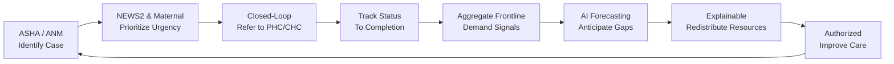

# VitaWeave Architecture

## System Overview & Continuous Coordination Loop

VitaWeave transitions rural healthcare from passive paperwork to active, closed-loop clinical and operational intelligence:



---

## High-Level Architecture Diagram

```mermaid
flowchart TB
    subgraph clients [Multi-Role Clients (Expo 57 / React Native 0.86)]
        ASHA["ASHA / ANM Mobile App<br/>(Offline-First • Daily Tasks • Triage)"]
        DOC["Doctor / PHC Console<br/>(Urgency Queue • Telemedicine)"]
        ADM["District Health Supervisor<br/>(Demand Intelligence • Resource Redistribution)"]
        PAT["Patient Health App<br/>(Meds • Teleconsult • ABHA)"]
    end

    subgraph app_core [Client Core Engine]
        ROUTER["Expo Router v6 (Role Groups)"]
        OFFLINE_DB[("WatermelonDB + SQLite<br/>(Local-First Offline Storage)")]
        SYNC_ENG["Offline Sync Engine<br/>(Queue • Conflict Merge)"]
        URGENCY["Clinical Urgency Engine<br/>(NEWS2 + Maternal Risk)"]
    end

    subgraph cloud_data [Cloud Database & Backend Services]
        FIREBASE[("Google Cloud Firebase / Firestore<br/>(Real-Time Cloud DB • Event Listeners)")]
        PG[("PostgreSQL + RLS (Supabase)<br/>(Relational Records • Auditing)")]
        AUTHZ["Multi-Tenant Auth & Role Guard"]
        EDGE["Edge Compute Functions<br/>(Proxy Gateways • Task Generation)"]
    end

    subgraph ai_tier [AI & Multimodal Intelligence Tier]
        GEMINI["Google Gemini Multimodal API<br/>(Prescription OCR • Lab Report Scanning • Gemini API Keys)"]
        GEMMA["Google Gemma / MedGemma<br/>(Frontline Clinical Copilot • Local Triage Reasoning)"]
    end

    subgraph comms [RTC & Observability]
        AGORA["Agora RTC (Low-Latency Video)"]
        SENTRY["Sentry Telemetry (PHI Scrubbed)"]
    end

    ASHA & DOC & ADM & PAT --> ROUTER
    ROUTER --> OFFLINE_DB
    OFFLINE_DB <--> SYNC_ENG
    SYNC_ENG <--> FIREBASE
    SYNC_ENG <--> PG
    ROUTER --> URGENCY
    ROUTER --> EDGE
    EDGE --> GEMINI
    EDGE --> GEMMA
    ROUTER --> AGORA
    ROUTER --> SENTRY
```

---

## Application layers

### 1. Presentation (`app/`)

Expo Router file-based routes with **role-based route groups**:

- `(asha)/` - Frontline community health worker interface (offline patient registration, daily priority tasks, camera document scanner, maternal ANC/PNC monitoring, community epidemic alerts).
- `(doctor)/` - Clinical provider interface (urgency-ranked outpatient queue, telemedicine consultations, visit recording, follow-up task generation).
- `(admin)/` - District health supervisor dashboard (demand intelligence heatmap, inter-PHC resource redistribution, care gap analytics, audit log).
- `(patient)/` - Citizen health companion (medication reminders, telemedicine booking, ABHA digital ID card).

Each group is protected by `useRoleGuard()` and biometric/session authentication.

### 2. Clinical Intelligence & Multimodal Scanning (`lib/`)

| Module | Responsibility |
|--------|----------------|
| `lib/gemini.ts` | **Google Gemini Vision & Multimodal API**: High-accuracy camera OCR for physical prescriptions, handwritten maternal health cards, immunization records, and lab results via secure Gemini API keys. |
| `lib/urgencyScoring.ts` | **NEWS2 + Maternal Physiology Engine**: Deterministic clinical risk scoring (0–100) integrated with explainable clinical rationale tags. |
| `lib/ai.ts` | **Google Gemma / MedGemma Architecture**: Clinical decision support, vernacular symptom interpretation (Hindi/Tamil/English), and differential triage prompts. |
| `lib/referralsApi.ts` | **Closed-Loop Referral Tracker**: Real-time referral lifecycle from ASHA dispatch to PHC doctor consultation and post-discharge follow-up. |
| `lib/syncEngine.ts` | **Offline Sync Engine**: Queues offline mutations in SQLite/WatermelonDB, synchronizing automatically with Google Cloud Firebase and PostgreSQL upon connectivity. |

### 3. Cloud Database Tier

- **Google Cloud Firebase / Firestore**: Real-time cloud document database facilitating low-latency state synchronization across field workers and district dashboards, with regional deployment in India (`asia-south1`).
- **PostgreSQL with Row Level Security (RLS)**: Enforces cryptographic multi-tenancy, immutable clinical history, and patient privacy (DPDP Act 2023).
- **Edge Compute Functions**: Secure server-side proxying for Gemini API keys, Agora video tokens, and automated daily task generation.

---

## Authentication flow

```
User enters email/password on login.tsx
        ↓
supabase.auth.signInWithPassword()
        ↓
completeRoleLogin() reads profiles.role
        ↓
AsyncStorage: user_id, user_role
        ↓
router.replace('/(role)/')
        ↓
_layout useRoleGuard() validates role on each screen
```

**Dev mode** (`EXPO_PUBLIC_DEV_MODE=true`): skip-login paths in `lib/devMode.ts` for UI demos without Supabase.

---

## Data flow examples

### Read path (doctor dashboard)

```
DoctorDashboard mount
  → getStoredUserId()
  → parallel: getUserProfile, getDoctorAppointments, getCampaigns,
              getPatientsForCaregiver, getCommunityAlerts
  → buildDoctorAlerts() + summarizeCommunitySignals()
  → syncRoleNotifications() (side effect)
  → render
```

### Write path (ASHA triage)

```
Patients screen: user sets risk High
  → updatePatientRisk(patientId, 'High')
  → supabase.from('patients').update(...)
  → RLS ensures asha can only update assigned patients
```

### AI chat path

```
useAIChat.sendMessage()
  → if EXPO_PUBLIC_USE_EDGE_PROXY: edgeClient.invoke('gemini-proxy')
  → else: lib/gemini.ts direct (dev only)
  → saveChatMessage() → ai_chat_history
```

---

## Telemedicine architecture

```
appointments.tsx: Join Call
        ↓
startTelemedicineSession(appointment, doctorId)
  ├── updateAppointmentStatus(id, 'Active')
  └── logVideoCallSession({ status: 'Active', channelName })
        ↓
router → telemedicine.tsx?appointmentId&channelName
        ↓
videoService.initialize() → Agora joinChannel
        ↓
handleEndCall()
        ↓
completeTelemedicineSession()
  ├── updateAppointmentStatus(id, 'Completed')
  └── logVideoCallSession({ status: 'Completed' })
```

**Security:** Agora App Certificate never ships in the client when using `agora-token` edge function.

---

## Deployment topology

| Environment | Mobile | Web | Backend |
|-------------|--------|-----|---------|
| Development | Expo Go / dev client | `npx expo start --web` | Supabase dev project |
| Staging | EAS internal distribution | Vercel preview | Supabase staging |
| Production | EAS → Play Store / App Store | Vercel production | Supabase prod + secrets |

---

## Cross-cutting concerns

- **Error handling:** `ErrorBoundary` + Sentry in production init (`lib/production.ts`)
- **Analytics:** `lib/analytics.ts` with PHI scrubbing
- **Logging:** `lib/logger.ts` - structured, level-based
- **Env validation:** `lib/envValidator.ts` on startup

---

## Extension points

1. **New role** - add to `lib/roles.ts`, create `app/(role)/`, extend RLS policies
2. **New clinical entity** - table in schema, functions in `api.ts`, screen in appropriate route group
3. **New AI tool** - edge function + hook; never expose API keys client-side in production
4. **FHIR export** - batch job reading `medical_records` + `patients` (roadmap)
