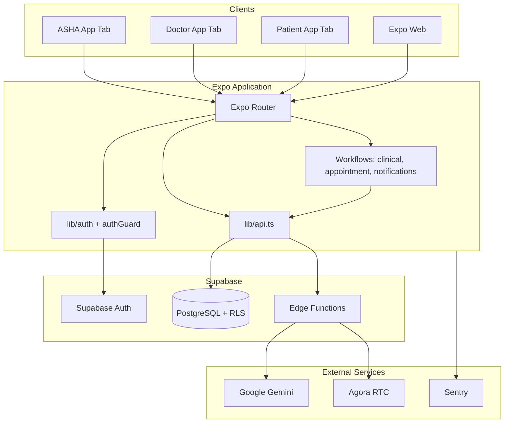

# VitaWeave Architecture

## High-level diagram



---

## Application layers

### 1. Presentation (`app/`)

Expo Router file-based routes with **route groups** by role:

- `(asha)/` - community health worker UI
- `(doctor)/` - clinical provider UI
- `(patient)/` - citizen-facing UI

Each group has a `_layout.tsx` that applies `useRoleGuard()` so users cannot navigate across roles without re-authentication.

### 2. Hooks (`hooks/`)

Thin React hooks that compose `lib/` functions:

| Hook | Responsibility |
|------|----------------|
| `useUserProfile` | Load `profiles` row + role-specific stats |
| `useCareTeamPatients` | Patients visible to logged-in caregiver |
| `useAIChat` | Gemini chat with `ai_chat_history` persistence |

### 3. Domain logic (`lib/`)

| Module | Responsibility |
|--------|----------------|
| `api.ts` | All Supabase CRUD; single integration point |
| `auth.ts` | Login, profile fetch, sign-out |
| `roles.ts` | Role enum and guards |
| `dataPolicy.ts` | When to show demo seed data vs live empty state |
| `patientMapper.ts` | DB patient row ↔ UI `Patient` type |
| `clinicalWorkflow.ts` | Visit documentation → follow-up tasks |
| `appointmentWorkflow.ts` | Telemedicine session ↔ appointment status |
| `communityHealth.ts` | Ward risk from alerts |
| `careNotifications.ts` | Dashboard-triggered local notifications |
| `phiSecurity.ts` | Redact PHI before logging/analytics |
| `consent.ts` | Consent flag in AsyncStorage |
| `edgeClient.ts` | Invoke Supabase edge functions |

### 4. Backend (`supabase/`)

- **`complete_schema.sql`** - tables, indexes, RLS policies, triggers
- **`functions/gemini-proxy`** - server-side Gemini calls
- **`functions/agora-token`** - RTC token minting with app certificate

---

## Authentication flow

```
User enters email/password on login.tsx
        ↓
supabase.auth.signInWithPassword()
        ↓
completeRoleLogin() reads profiles.role
        ↓
AsyncStorage: user_id, user_role
        ↓
router.replace('/(role)/')
        ↓
_layout useRoleGuard() validates role on each screen
```

**Dev mode** (`EXPO_PUBLIC_DEV_MODE=true`): skip-login paths in `lib/devMode.ts` for UI demos without Supabase.

---

## Data flow examples

### Read path (doctor dashboard)

```
DoctorDashboard mount
  → getStoredUserId()
  → parallel: getUserProfile, getDoctorAppointments, getCampaigns,
              getPatientsForCaregiver, getCommunityAlerts
  → buildDoctorAlerts() + summarizeCommunitySignals()
  → syncRoleNotifications() (side effect)
  → render
```

### Write path (ASHA triage)

```
Patients screen: user sets risk High
  → updatePatientRisk(patientId, 'High')
  → supabase.from('patients').update(...)
  → RLS ensures asha can only update assigned patients
```

### AI chat path

```
useAIChat.sendMessage()
  → if EXPO_PUBLIC_USE_EDGE_PROXY: edgeClient.invoke('gemini-proxy')
  → else: lib/gemini.ts direct (dev only)
  → saveChatMessage() → ai_chat_history
```

---

## Telemedicine architecture

```
appointments.tsx: Join Call
        ↓
startTelemedicineSession(appointment, doctorId)
  ├── updateAppointmentStatus(id, 'Active')
  └── logVideoCallSession({ status: 'Active', channelName })
        ↓
router → telemedicine.tsx?appointmentId&channelName
        ↓
videoService.initialize() → Agora joinChannel
        ↓
handleEndCall()
        ↓
completeTelemedicineSession()
  ├── updateAppointmentStatus(id, 'Completed')
  └── logVideoCallSession({ status: 'Completed' })
```

**Security:** Agora App Certificate never ships in the client when using `agora-token` edge function.

---

## Deployment topology

| Environment | Mobile | Web | Backend |
|-------------|--------|-----|---------|
| Development | Expo Go / dev client | `npx expo start --web` | Supabase dev project |
| Staging | EAS internal distribution | Vercel preview | Supabase staging |
| Production | EAS → Play Store / App Store | Vercel production | Supabase prod + secrets |

---

## Cross-cutting concerns

- **Error handling:** `ErrorBoundary` + Sentry in production init (`lib/production.ts`)
- **Analytics:** `lib/analytics.ts` with PHI scrubbing
- **Logging:** `lib/logger.ts` - structured, level-based
- **Env validation:** `lib/envValidator.ts` on startup

---

## Extension points

1. **New role** - add to `lib/roles.ts`, create `app/(role)/`, extend RLS policies
2. **New clinical entity** - table in schema, functions in `api.ts`, screen in appropriate route group
3. **New AI tool** - edge function + hook; never expose API keys client-side in production
4. **FHIR export** - batch job reading `medical_records` + `patients` (roadmap)
