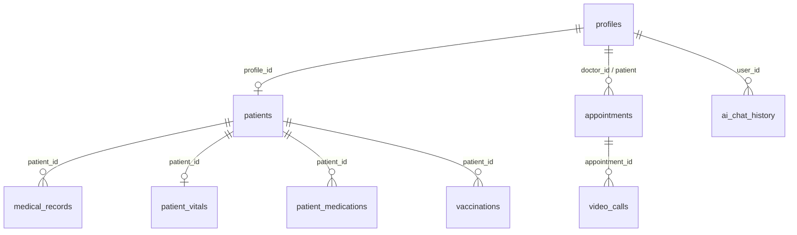

# Data Model

Canonical schema: [`supabase/complete_schema.sql`](../supabase/complete_schema.sql)

---

## Entity relationship overview



---

## Core tables

### `profiles`

Extends Supabase `auth.users`. One row per login.

| Column | Type | Notes |
|--------|------|-------|
| `id` | UUID PK | Matches `auth.users.id` |
| `email` | text | |
| `name` | text | Display name |
| `role` | text | `asha`, `doctor`, `patient`, `admin` |
| `phone` | text | |
| `ward` | text | Geographic assignment |
| `language` | text | UI preference |
| `avatar_url` | text | Optional |
| `level` | int | Gamification / tenure |
| `lives_impacted` | int | ASHA impact metric |

### `patients`

Community members registered by ASHA/doctor - may or may not have login.

| Column | Notes |
|--------|-------|
| `id` | UUID PK |
| `profile_id` | FK → profiles (if patient has app account) |
| `asha_id` | Assigned ASHA worker |
| `name`, `age`, `gender`, `phone`, `address`, `ward` | Demographics |
| `risk_level` | `Low`, `Medium`, `High` |
| `status` | `Active`, `Stable`, `Critical`, etc. |
| `conditions` | text[] or jsonb |
| `last_visit` | timestamptz |

### `appointments`

| Column | Notes |
|--------|-------|
| `id` | UUID PK |
| `patient_id` | FK → patients |
| `doctor_id` | FK → profiles |
| `appointment_time` | timestamptz |
| `title` | Visit reason |
| `status` | `Scheduled`, `Active`, `Completed`, `Cancelled`, `No-Show` |
| `notes` | Optional |

### `medical_records`

Clinical documentation from doctor visits.

### `patient_vitals` / `patient_medications`

One-to-many health data per patient profile or patient row.

### `vaccinations`

| Column | Notes |
|--------|-------|
| `patient_id` | FK |
| `vaccine_name` | |
| `due_date` | |
| `status` | `due`, `completed` |
| `administered_by` | ASHA profile id |

### `video_calls`

Audit log for telemedicine sessions.

| Column | Notes |
|--------|-------|
| `appointment_id` | FK |
| `channel_name` | Agora channel |
| `host_id` | Doctor profile |
| `status` | `Active`, `Completed` |
| `started_at`, `ended_at` | |

### `dashboard_tasks`

ASHA task queue (`priority`: urgent, today, routine).

### `community_alerts` / `weekly_alerts`

Ward-level signal feeds for dashboards.

### `campaigns`

Public health campaigns (immunization drives, etc.).

### `ai_chat_history`

| Column | Notes |
|--------|-------|
| `user_id` | FK → profiles |
| `role` | Context role |
| `message` | |
| `is_user` | boolean |

---

## Row Level Security (RLS)

RLS is **enabled** on clinical tables. Policies follow these principles:

1. **Authenticated only** - `auth.uid()` must be non-null
2. **Role scoping** - ASHA sees assigned patients; doctors see their appointments and patients; patients see own `profile_id` linked data
3. **Writes validated** - insert/update policies check `profile_id = auth.uid()` or caregiver assignment

Example pattern (simplified):

```sql
-- Patients visible to assigned ASHA
CREATE POLICY "asha_select_patients" ON patients
  FOR SELECT USING (asha_id = auth.uid());
```

Full policies are in sections 10–18 of `complete_schema.sql`.

**Important:** Apply the **entire** schema file on a fresh Supabase project - partial applies may miss policy updates.

---

## Status enums reference

| Entity | Values |
|--------|--------|
| Appointment | Scheduled, Active, Completed, Cancelled, No-Show |
| Vaccination | due, completed |
| Patient risk | Low, Medium, High |
| Video call | Active, Completed |

---

## Migrations

Apply after `complete_schema.sql`:

| File | Adds |
|------|------|
| `002_core_features.sql` | referrals, urgency_score, reminders, district_metrics, push_tokens |
| `003_tier3_compliance.sql` | abha_id, audit_log, scoring_audit, asha_compliance_logs |
| `004_anc_pnc.sql` | pregnancies, anc_visits, pnc_visits, date_of_birth |
| `005_referral_ladder.sql` | chc / district_hospital / asha_escalate referral types |
| `006_consent_data_rights.sql` | consent_records, data_rights_requests |
| `007_surveillance_campaigns.sql` | campaign publish + alert source/ward |

Local offline mirror: WatermelonDB (`lib/db/watermelonSchema.ts` + `lib/db/tableDefs.ts`) synced via `lib/sync/SyncService.ts`.

---

## Seed data strategy

- **Development:** Insert profiles matching Auth users; add patients with `asha_id` set
- **Demo mode:** `app/constants/data.ts` provides UI fallback when `EXPO_PUBLIC_DEV_MODE=true`
- **Never seed PHI** in public repositories

---

## Indexes

`complete_schema.sql` includes indexes on:
- `patients(asha_id)`, `patients(risk_level)`
- `appointments(doctor_id, appointment_time)`
- Foreign keys on clinical tables

---

## API mapping

All client access goes through `lib/api.ts` - grep for `from('table_name')` to find exact queries. Do not call Supabase directly from screens (convention).
