# VitaWeave - Government App Pitch Deck Blueprint

**Product:** VitaWeave - AI-powered community health operating system for rural India  
**Audience:** State / district health departments, NHM offices, NGOs, hospital networks, impact investors  
**Stage:** Functional MVP (Expo + Supabase) · Pilot-ready  
**Alignment:** SDG 3 · Ayushman Bharat Digital Mission (ABDM) · DPDP Act 2023  

> Use this file as a **slide-by-slide master blueprint**. Each slide has four fixed sections: title & objective, core copy, visual layout, and a renderable diagram/visual. Mermaid blocks render natively in Cursor / GitHub.

---

## Slide 1 - Cover Page

### 1. [Slide Title & Objective]

**Title:** VitaWeave - Rural Health. Connected.  
**Objective:** Open with brand authority and a one-sentence value loop: *citizen/worker need → intelligent triage → government action → better outcomes.* Leave the room remembering: *India built the infrastructure; VitaWeave is the missing intelligence layer.*

### 2. [Core Copy & Bullet Points]

- **Brand:** VitaWeave  
- **Headline:** From data collection to decision intelligence  
- **One-liner:** Every village already has a health worker. VitaWeave gives her a brain to think with.  
- **Sector:** Digital Public Health / HealthTech (B2G · G2C · G2B)  
- **Stage:** Functional MVP · Pilot - India rural PHC networks  
- **Org line:** Pragati AI for Impact · Healthcare Domain  
- **Footer meta:** `[DATE]` · Confidential · `[CITY / EVENT]`

### 3. [Visual Layout Instructions]

- Full-bleed soft gradient (deep teal → muted forest green). Avoid purple / cream / newspaper looks.  
- Brand name large, top-left or center-dominant (hero-level, not nav-sized).  
- One-liner under brand; meta chips bottom edge only.  
- Center the Mermaid value-loop as the sole visual focal point beneath the headline.  
- High contrast: white/off-white text on dark teal; accent highlight on “Decision Intelligence.”

### 4. [Diagram/Visual Element]

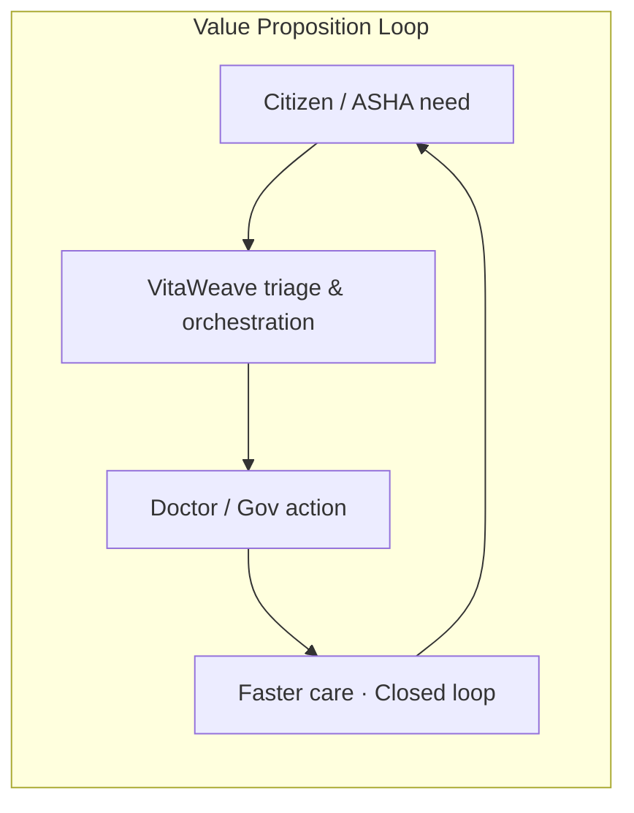

---

## Slide 2 - The Problem

### 1. [Slide Title & Objective]

**Title:** The Problem - Data Without Decisions  
**Objective:** Make citizen friction and government bureaucratic/data-silo pain feel urgent and undeniable. Shift the room from “another health app” to “we are losing time (and lives) between signal and action.”

### 2. [Core Copy & Bullet Points]

**Citizen / frontline friction**
- ~**1,000,000+** ASHA / ANM workers decide *who to visit first* from memory and paper  
- High-risk pregnancy and routine check-up look identical until it is too late  
- Referrals die on paper / phone calls - **no tracking, no accountability**  
- Patients lack continuity; records fragment across facilities  

**Government / system friction**
- India already collects enormous rural health data - **priority is missing**  
- ANMOL / RCH-style systems digitize **reporting**, not **who needs help now**  
- District offices see form counts, not live care gaps  
- Telemedicine infrastructure (e.g. eSanjeevani scale) exists, but **triage + closed-loop referral** does not sit in front of the call  

**Punchline:** India digitized the paperwork of rural healthcare - not the decision-making.

**Metric placeholders**
- Avg. delay from identifiable high-risk case → ASHA visit: `[X hours / days]`  
- Referral completion rate today: `[Y%]`  
- Rural doctor-to-patient gap vs WHO norm: `[cite]`

### 3. [Visual Layout Instructions]

- Two-column pain map: left = Citizen / ASHA friction; right = Government silos.  
- Dark charcoal background; coral/amber callout only on the punchline bar at bottom.  
- No cards in hero sense - use two clean columns with thin divider.  
- Icons optional but minimal; prefer short verbs over icons rows.

### 4. [Diagram/Visual Element]

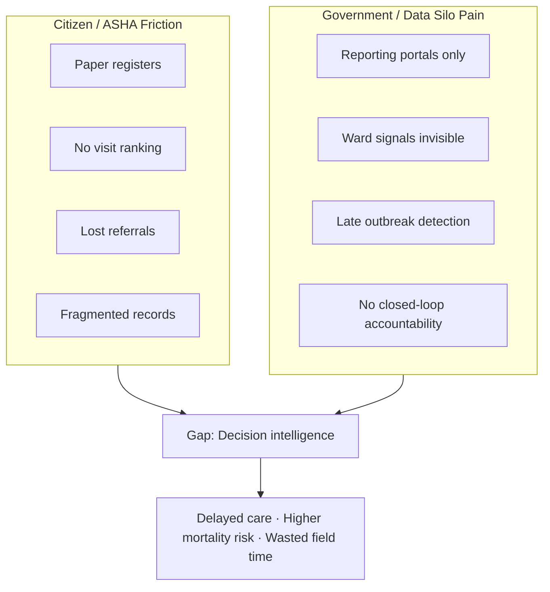

---

## Slide 3 - The Solution

### 1. [Slide Title & Objective]

**Title:** The Solution - Care Orchestration in One App  
**Objective:** Show VitaWeave as a **decision-support layer** (not another EMR), with a clear split: product interface (left) vs value proposition (right).

### 2. [Core Copy & Bullet Points]

**Left - App interface (shipped roles)**
- **ASHA:** Offline patient registry · priority score · vaccinations (India UIP) · ANC/PNC · referrals · community alerts · Gemini AI assistant (en / hi / ta)  
- **Doctor:** Urgency-sorted queue · Agora telemedicine · visit notes · campaigns · referrals inbox  
- **Patient (G2C):** Book appointments · meds · vitals · ABHA card · DPDP export / erasure  
- **District supervisor (G2G console):** Metrics · audit log · scoring audit  

**Right - Value proposition**
- Rule-based **urgency scoring** (NEWS2 + maternal modifiers) → *who to see next*  
- **Closed-loop referrals:** pending → acknowledged → completed  
- **Offline-first** (WatermelonDB + sync) for low-connectivity villages  
- Works **alongside** government systems (ABDM-ready adapters), does not replace them  

**One-line USP:** eSanjeevani connects people to a video call. VitaWeave decides who needs that call first.

### 3. [Visual Layout Instructions]

- Strict **50/50 split**: left = phone mock frame with role tabs; right = 4 value bullets + USP bar.  
- Teal accent on “urgency scoring” and “closed-loop.”  
- Keep first viewport sparse: brand echo, one headline, one supporting sentence above the split.

### 4. [Diagram/Visual Element]

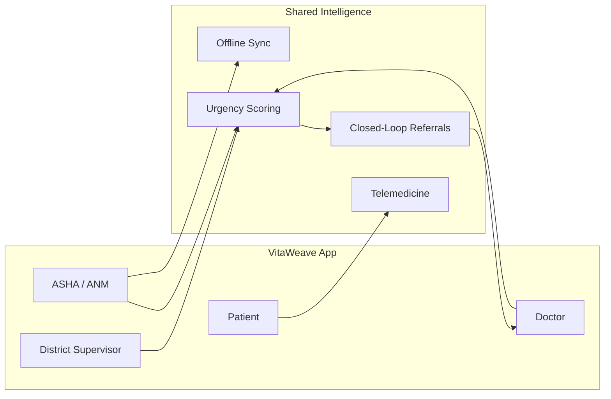

---

## Slide 4 - Market Size

### 1. [Slide Title & Objective]

**Title:** Market Size - A Government-Funded Market Missing Its Brain  
**Objective:** Prove scale with nested TAM → SAM → SOM. Frame as expansion of funded digital health, not a greenfield consumer app.

### 2. [Core Copy & Bullet Points]

- **TAM - India Digital Public Health / Digital Health Market:** `$[TAM_Bn]+` by `[YEAR]` (cite live report)  
- **SAM - Rural frontline + PHC digitization budgets:** ~**1M+** ASHA/ANM users · NHM / state health society procurement · ABDM-aligned platforms  
- **SOM - 3-year beachhead:** `[N]` districts · `[W]` ASHA seats licensed · `$[SOM_Mn]` ARR  
- **Proof of government spend appetite:** eSanjeevani scale (430M+ consultations class of infrastructure) - demand exists; intelligence layer does not  
- **Export note:** Same engine applicable to Sub-Saharan Africa / SEA / LatAm frontline systems after India validation  

**Placeholder metrics**
- ASHA workforce: **~1,000,000**  
- Catchment per ASHA: **3,000–5,000** people  
- Pilot SOM Year 1: **50 ASHA / 1 district** → `$[ARR_Y1]`

### 3. [Visual Layout Instructions]

- Nested concentric / subgraph layout centered; numbers large inside each ring.  
- Cool slate background; brightest fill on SOM (nearest money).  
- Caption under diagram: “Not a new market - a funded market without decision support.”

### 4. [Diagram/Visual Element]

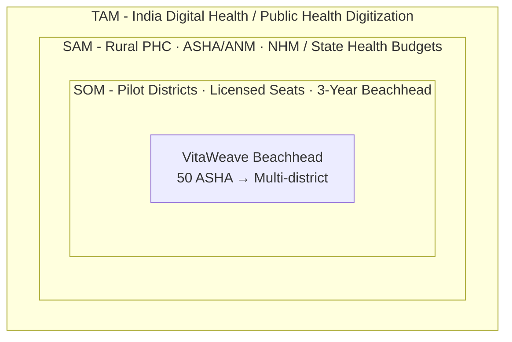

---

## Slide 5 - Product & Core Features

### 1. [Slide Title & Objective]

**Title:** Product - What Ships Today  
**Objective:** Ground claims in the real MVP. Credibility over vaporware. Separate **shipped** from **roadmap** in one glance.

### 2. [Core Copy & Bullet Points]

**Shipped (Functional MVP)**
- Multi-role Expo app: ASHA · Doctor · Patient · District supervisor  
- Priority / urgency scoring with scoring audit trail  
- Closed-loop referrals (PHC → CHC → District Hospital ladder)  
- Vaccinations (India UIP calendar) · ANC/PNC modules  
- Agora telemedicine (Scheduled → Active → Completed)  
- Gemini MedGemma-style AI assistant (edge-proxied keys)  
- Offline-first WatermelonDB + sync status  
- Outbreak cluster detector (≥5 similar symptoms / ward / 7 days)  
- Push digests · consent · PHI redaction · Sentry  
- ABHA M1 storage + mock ABDM link UX · DPDP download / erasure UI  

**Roadmap (do not overclaim)**
- Live ABDM HIP/HIU · DHIS2 / CSV export · full schemes navigator · wearables · MedRide · workforce marketplace  

**Pilot KPI placeholders**
- High-risk cases correctly prioritized / week: `[+X%]`  
- Referral completion rate: `[+Y pp]`  
- Time-to-visit for flagged cases: `[-Z%]`

### 3. [Visual Layout Instructions]

- Icon-free capability grid: 2×4 for shipped; thin “Roadmap” strip at bottom in muted tone.  
- Green check language for shipped; grey for roadmap.  
- Focal point: “Urgency Scoring + Closed-Loop Referral” as the product spine.

### 4. [Diagram/Visual Element]

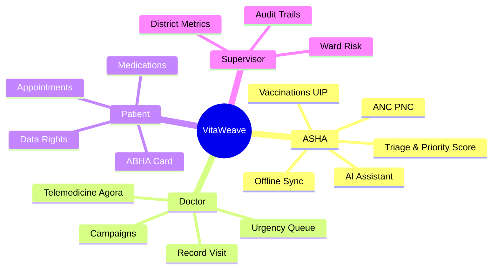

---

## Slide 6 - System Integration Architecture

### 1. [Slide Title & Objective]

**Title:** Architecture - Secure Path from Field to Government Systems  
**Objective:** Reassure technical and security buyers: Citizen App → Secure API Gateway → Government / clinical core, with **encryption points called out**.

### 2. [Core Copy & Bullet Points]

- **Clients:** ASHA / Doctor / Patient / Supervisor (Expo)  
- **Gateway:** Supabase Auth JWT + Edge Functions (`gemini-proxy`, `agora-token`, `send-push`, `data-rights`, `daily-task-generation`)  
- **Core data:** PostgreSQL + **Row Level Security**  
- **Device:** WatermelonDB SQLite with **field encryption** (phone, ABHA, notes, Rx)  
- **Transit:** HTTPS only · Agora encrypted RTC  
- **AI / Video:** Gemini & Agora certificates **never in APK** (edge secrets)  
- **Residency:** `ap-south-1` (Mumbai) recommended for India pilots  
- **Gov adjacency:** ABDM / ABHA adapters (mock → live sandbox) · UIP calendar · referral ladder; DHIS2 export on roadmap  

**Encryption callouts**
1. TLS in transit  
2. Device field encryption at rest  
3. Edge-held API secrets  
4. RLS as authorization firewall  

### 3. [Visual Layout Instructions]

- Horizontal pipeline left→right; encryption badges as small lock markers on edges.  
- Legacy / gov systems on far right in dashed subgraph (integration, not ownership).  
- Dark navy slide; neon-teal only on encryption labels.

### 4. [Diagram/Visual Element]

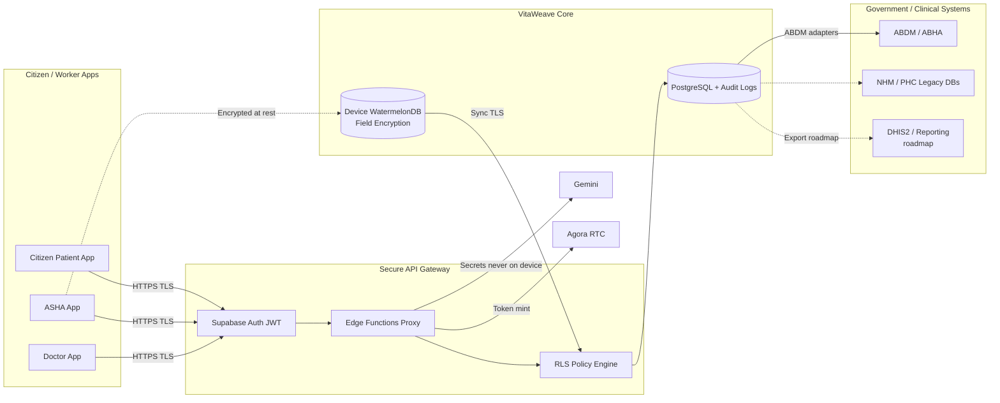

---

## Slide 7 - Regulatory, Security & Compliance

### 1. [Slide Title & Objective]

**Title:** Trust - Data Residency, Security & Compliance Map  
**Objective:** Show a clear compliance pathway for India-first procurement (DPDP / ABDM) and optional international frameworks (SOC 2, FedRAMP, GDPR) without claiming fake certifications.

### 2. [Core Copy & Bullet Points]

| Framework | Status in VitaWeave | Evidence |
|-----------|---------------------|----------|
| **India DPDP Act 2023** | Pathway in product | Consent screen · privacy policy · purpose-limited RLS · download / erasure (`data-rights`) |
| **ABDM / ABHA** | M1 + mock M2 UX | `abha_id` · MockAbdmClient · eRx JSON builder; live sandbox ready |
| **Data residency** | India-first design | Supabase `ap-south-1` (Mumbai) guard |
| **Security controls** | Implemented foundation | RLS · edge secret proxy · PHI scrubbing · audit_log / scoring_audit · Sentry scrub hooks |
| **HIPAA** | Foundation only | Needs BAA + org processes for US pilots |
| **SOC 2** | Vendor + org pathway | Target via cloud vendor attestations + company controls - `[TARGET_DATE]` |
| **FedRAMP** | Not claimed | Relevant only for US federal; architecture notes for future - `[N/A or phase]` |
| **GDPR** | Mapping ready | Consent · minimization · export/erasure patterns portable to EU partners |

**Hard truth line:** Architecture supports compliance; certifications require legal + organizational work. We do not fake badges.

### 3. [Visual Layout Instructions]

- Compliance matrix as primary visual (table).  
- Color: green = in product; amber = pathway; grey = not claimed.  
- Side callout: “Counsel required · NHM data agreements · DPA/BAA with vendors.”

### 4. [Diagram/Visual Element]

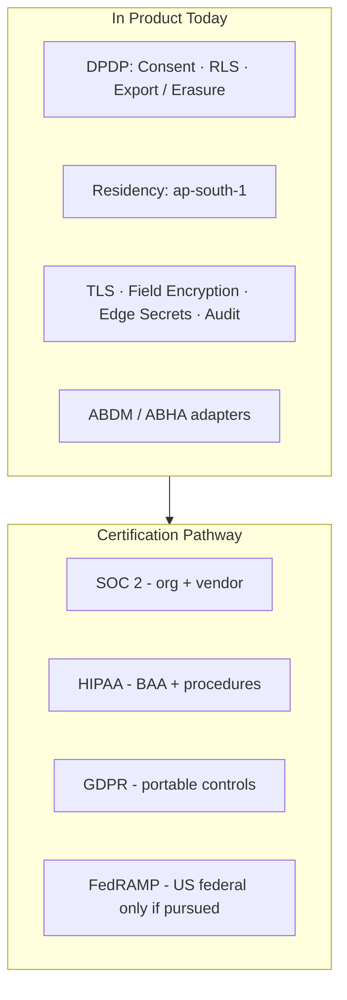

---

## Slide 8 - Citizen & Government User Flow

### 1. [Slide Title & Objective]

**Title:** End-to-End Flow - Request → Process → Approve → Notify  
**Objective:** Make the transaction visceral: a rural case moves from field signal to clinical action with accountability visible to government supervisors.

### 2. [Core Copy & Bullet Points]

1. **Citizen / ASHA registers or updates** patient (works offline)  
2. **App scores urgency** → task jumps to top of ASHA list  
3. **Referral or telemedicine** escalates to doctor / facility  
4. **Doctor acknowledges / completes** (visit + optional eRx)  
5. **Citizen notified**; supervisor sees metrics / audit  
6. **Loop closes** - no silent drop-offs  

**Status chain (referrals):** `pending → acknowledged → completed`  
**Appointments:** `Scheduled → Active → Completed` (tied to Agora session)

### 3. [Visual Layout Instructions]

- Sequence diagram full-width; swimlane labels clear.  
- Highlight “Notify” and “Completed” in accent teal.  
- Minimal text outside the diagram - let the sequence tell the story.

### 4. [Diagram/Visual Element]

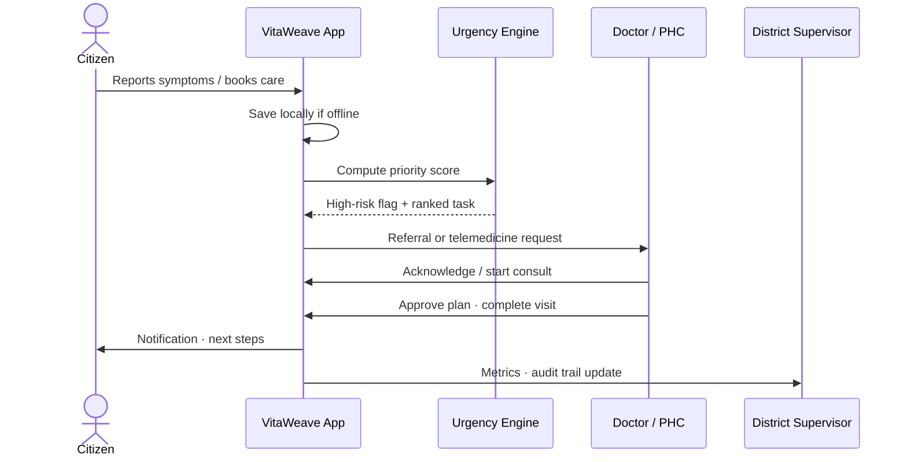

---

## Slide 9 - Business & Revenue Model

### 1. [Slide Title & Objective]

**Title:** Who Pays - B2G / G2C / G2B Cash-Flow Ecosystem  
**Objective:** Show a procurement-friendly model: government and institutions pay; citizens and ASHAs use for free at point of care; savings return as measurable public value.

### 2. [Core Copy & Bullet Points]

| Stream | Who pays | Tier idea | Value return |
|--------|----------|-----------|--------------|
| **B2G licensing** | State NHM / District Health Society | Per-ward / per-block / per-ASHA seat · `$[PRICE]/seat]/yr]` | Fewer missed high-risk visits · audit-ready reporting |
| **G2B / B2B hospitals** | PHC networks · private hospital chains | Referral analytics + telemedicine pipeline · `$[TIER]` | Better catchment conversion · reduced late arrivals |
| **NGO / program packs** | NGOs · CSR | Maternal / TB / NCD campaign modules | Campaign completion lift `[+X%]` |
| **Future marketplace** | Hospitals / NGOs matching flexible workers | Small placement fee | Surge capacity without headcount freeze |
| **Telemedicine / insurance share** | Partners | Rev-share on routed consults / enrollment | Expanded access, shared economics |

**Principle:** Core worker-facing app stays **free at point of use** - critical for ASHA adoption.

**Cost-saving return to government (placeholders)**
- Field time recovered: `[hrs/ASHA/week]`  
- Avoidable emergency escalations: `[-X%]`  
- Cost per closed referral vs paper baseline: `$[A] → $[B]`

### 3. [Visual Layout Instructions]

- Cash-flow Mermaid as center; pricing table below in small type.  
- Arrows labeled “pays” vs “uses free” vs “saves.”  
- Avoid cluttered multi-product pricing - three primary arrows max in diagram.

### 4. [Diagram/Visual Element]

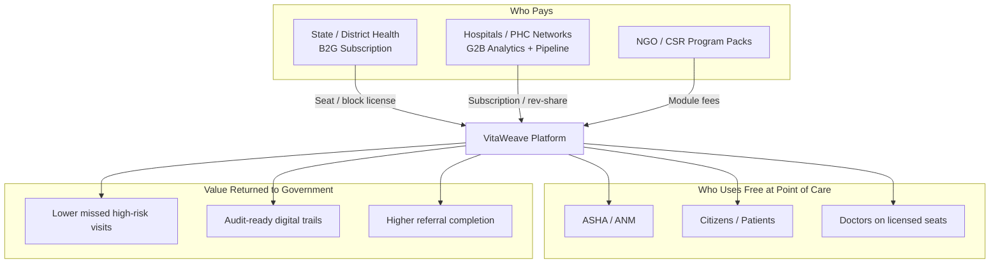

---

## Slide 10 - Procurement & GTM Strategy

### 1. [Slide Title & Objective]

**Title:** Go-to-Market - Pilots First, Tenders Second  
**Objective:** Show you understand government sales: long cycles are real - so we **design around them** with pilots, frameworks, and proof metrics.

### 2. [Core Copy & Bullet Points]

**Path that bypasses 18-month dead ends**
1. **90-day ward / block pilot** - 50 ASHA + 2 doctors + supervisor console · M&E scorecard  
2. **NGO / CSR co-fund** - bridge budget while tender forms  
3. **Rate-contract / GeM / empanelment** - once KPIs proven  
4. **State framework agreement** - multi-district expansion without re-selling each block  
5. **ABDM alignment narrative** - interoperability path, not parallel silo  

**GTM motions**
- Land: District Health Officer / NHM SPO / medical college PHC network  
- Expand: Adjacent blocks · maternal health pack · hospital referral partners  
- Defend: Audit trails + offline reliability + urgency outcomes competitors lack  

**Sales-cycle hack placeholders**
- Pilot LOI target: `[DATE]`  
- Tender / GeM listing: `[DATE]`  
- State expansion decision gate: `[KPI threshold]`

### 3. [Visual Layout Instructions]

- Horizontal timeline: Pilot → Evidence → Framework → Scale.  
- Callout box (single): “We sell outcomes, then seats - not vaporware RFPs.”  
- Keep language simple for non-procurement audiences too.

### 4. [Diagram/Visual Element]

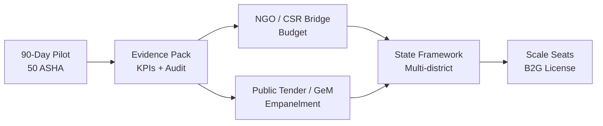

---

## Slide 11 - Competitive Landscape

### 1. [Slide Title & Objective]

**Title:** Competitive Landscape - Our Unfair Advantage  
**Objective:** Position VitaWeave in the empty quadrant: **high decision-support + works offline**. Respect incumbents; claim the white space.

### 2. [Core Copy & Bullet Points]

| Capability | ANMOL / RCH | CommCare | eSanjeevani | Urban apps (Practo-class) | **VitaWeave** |
|------------|-------------|----------|-------------|---------------------------|---------------|
| Data capture / reporting | Strong | Forms | Consult data | Booking | Yes |
| Frontline urgency scoring | No | No | No | N/A | **Yes** |
| Closed-loop referrals | Weak | Limited | Partial gaps | N/A | **Yes** |
| Offline-first field UX | Limited | Varies | Needs connectivity | Assumes net | **Yes** |
| ASHA + Doctor + Patient + Supervisor | Partial | Configurable | Video focus | Patient–doctor | **Unified** |
| ABDM-oriented path | Gov native | External | Gov native | Varies | **Adapters** |

**Unfair advantage**
- Decision intelligence for the **ASHA as primary user**, not clerk  
- Rule-based scoring + audit (governable for public health)  
- Offline sync designed for real villages  
- Telemedicine **after** triage - not instead of it  

### 3. [Visual Layout Instructions]

- Top: compact comparison grid.  
- Bottom: 2×2 quadrant (decision-support vs connectivity). Star only on VitaWeave.  
- Do not trash government systems - frame as complementary intelligence layer.

### 4. [Diagram/Visual Element]

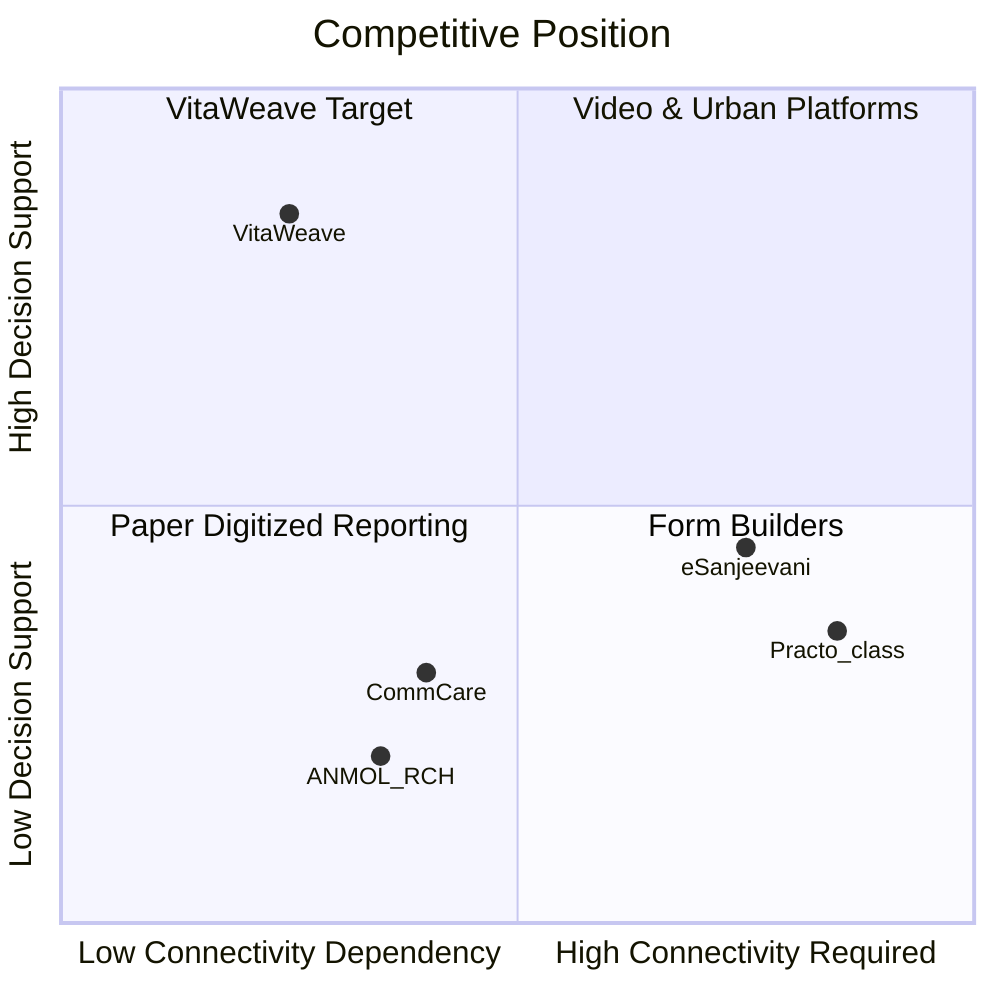

---

## Slide 12 - The Team & Governance

### 1. [Slide Title & Objective]

**Title:** Team & Governance - Built to Pilot with the Public System  
**Objective:** Show operational clarity and advisory oversight suitable for government trust - even while individual names remain fill-in fields.

### 2. [Core Copy & Bullet Points]

**Operating team (placeholders)**
- **Product / Engineering Lead:** `[NAME]` - Expo / Supabase platform  
- **Clinical / Public Health Lead:** `[NAME]` - protocol validation for urgency rules  
- **Field Implementation:** `[NAME]` - ASHA training · PHC change management  
- **Security & Compliance:** `[NAME]` - DPDP · DPIA · vendor DPAs  

**Advisory / governance**
- Clinical advisory board (OB-GYN · pediatrics · district health) - `[NAMES]`  
- Data protection counsel - `[FIRM]`  
- NGO / NHM liaison - `[ORG]`  
- Org attribution: **Pragati AI for Impact · Healthcare Domain**  

**Operating cadence**
- Weekly pilot stand-up with district nodal officer  
- Monthly M&E review against scorecard  
- Quarterly security / access audit of RLS + audit_log  

### 3. [Visual Layout Instructions]

- Org chart Mermaid center; photos optional later.  
- Separate “Advisory” subgraph visually from “Operating.”  
- Clean white/slate; no decorative badges.

### 4. [Diagram/Visual Element]

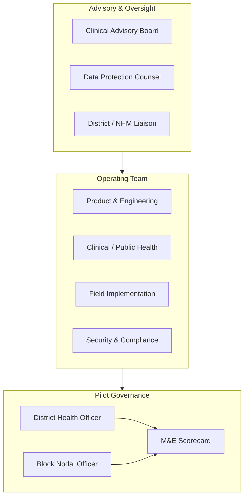

---

## Slide 13 - Financial Projections & The Ask

### 1. [Slide Title & Objective]

**Title:** Traction Plan, Funding Ask & Use of Funds  
**Objective:** Close with concrete 3-year milestones, a clear ask, and an allocation pie that maps to pilot reality - not vanity burn.

### 2. [Core Copy & Bullet Points]

**3-year revenue milestones (placeholders - replace before live pitch)**

| Year | Milestone | Revenue | Seats / Footprint |
|------|-----------|---------|-------------------|
| **Y1** | 1 district pilot → paid expansion | `$[R1]` | 50 → `[N1]` ASHA seats |
| **Y2** | Multi-district + 2–3 hospital partners | `$[R2]` | `[N2]` seats · `[H]` hospitals |
| **Y3** | State framework + NGO packs | `$[R3]` | `[N3]` seats · `[S]` states/modules |

**The Ask**
1. **Pilot funding:** deploy **50 ASHA** cohort with district / PHC partner - `$[ASK_TOTAL]`  
2. **Clinical mentorship:** validate urgency scoring vs accepted protocols  
3. **Regulatory support:** DPDP / health-data counsel · vendor DPA/BAA  
4. **Introductions:** State Health Dept · NHM-aligned programs · NGO co-funders  

**Use of funds (illustrative allocation)**
- Product hardening & production schema: **35%**  
- Field pilot ops & ASHA training: **25%**  
- Security / DPDP / clinical review: **20%**  
- Telemedicine & ABDM live integration: **15%**  
- Contingency / working capital: **5%**  

**Closing line:** India built the world’s largest digital health *infrastructure*. VitaWeave is built to be its missing *intelligence layer*.

### 3. [Visual Layout Instructions]

- Left: 3-year milestone bars.  
- Right: ask list + allocation Mermaid.  
- End with closing quote in a single full-width band - no extra CTAs clutter.

### 4. [Diagram/Visual Element]

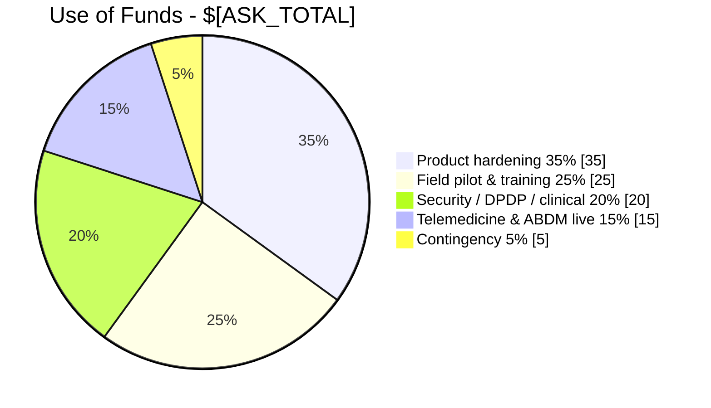

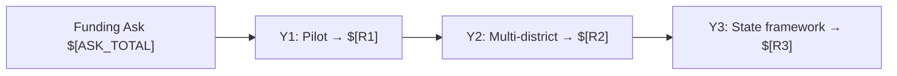

---

## Appendix - Presenter Notes (Not a Slide)

### Demo proof points (shipped today)
1. ASHA login → community risk + prioritized tasks  
2. Triage update → urgency score + scoring audit  
3. Referral create → status timeline to completion  
4. Doctor queue sorted by priority → Agora telemedicine → Completed  
5. Patient book + medication mark-taken · DPDP controls  
6. Supervisor: district metrics + audit trails  
7. Airplane-mode write → sync indicator on reconnect  

### Language rules for live rooms
- Say **decision intelligence**, not “AI diagnoses.”  
- Say **works with ABDM / NHM systems**, not “replaces government software.”  
- Say **foundation for compliance**, not “we are SOC 2 / FedRAMP certified” unless true.  
- Keep ASHA app **free at point of use** in every procurement narrative.

### Source-of-truth in repo
- Product reality: `README.md`, `docs/ARCHITECTURE.md`, `docs/SECURITY_AND_COMPLIANCE.md`, `docs/ROADMAP.md`  
- Narrative companion: `project.md`  
- Older investor notes in `docs/PITCH.md` should be treated as superseded by this deck + current README.

---

*End of 13-slide master blueprint - `government_app_pitch_deck.md`*
